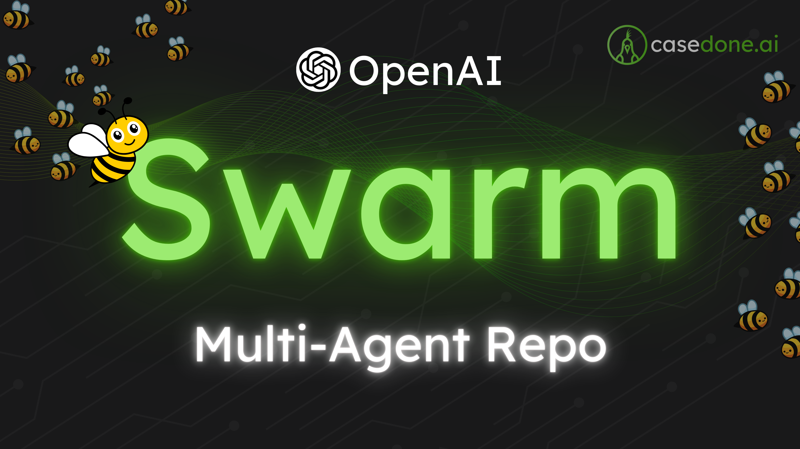
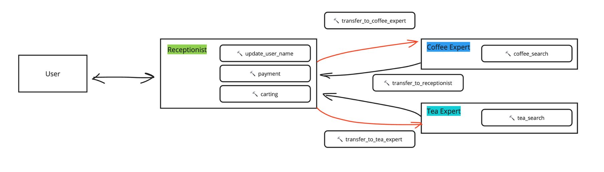

# Swarm Demo by Case Done




> This repo contains materials that were discussed in [OpenAI Swarm Repo: Deep Dive into Multi-Agent LLM app
](https://youtu.be/Wj7C8hlwYQs?si=JIBYUYEe4eMXrvZ4).

Swarm is a repo released by OpenAI and it's meant to educate and illustrate what OpenAI thinks should be a framework for multi-agent collaboration. This repo is only for educational and fun since it will not be maintained.

In this demo, we played with the demo to explore how agents hand off tasks to other agents.

## Steps
1. Make your OpenAI API key available. Create a folder called `secret` in the root directory. Then, create a text file called `openai_api_key.txt` and put your API key there.
2. Make sure you install necessary packages to run `swarm` repo. Follow the instruction [here](https://github.com/openai/swarm). You may use
```shell
pip install -r requirements.txt
```
3. Run notebooks either `basic.ipynb` or `demo-cafe.ipynb`

## Sharing & Crediting

> Feel free to copy and distribute, but we appreciate you giving us credits.

## ⛓️Connect with Us:

👍 Like | 🔗 Share | 📢 Subscribe | 💬 Comments | ❓ Questions

[LinkedIn](www.linkedin.com/company/casedonebyai) <br>
[YouTube](www.youtube.com/@CaseDonebyAI) <br>
[Facebook](www.facebook.com/casedonebyai) <br>
[TikTok](www.tiktok.com/@casedonebyai) <br>
[Github](www.github.com/casedone) <br>
[SubStack](casedonebyai.substack.com)